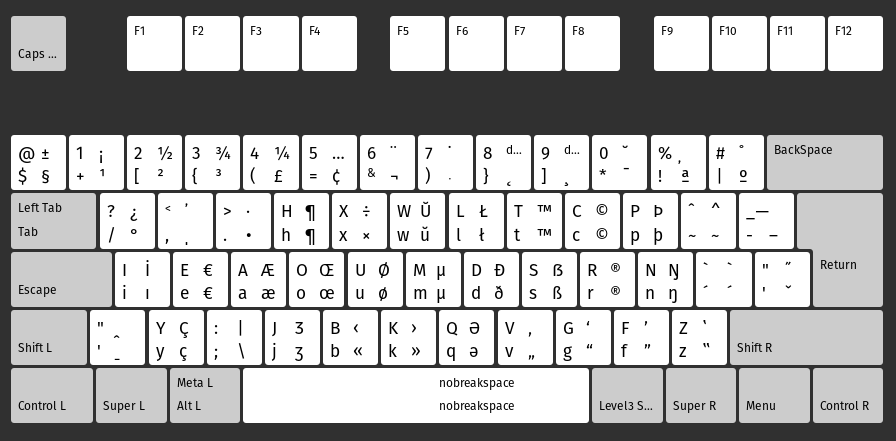

## Nativo For programmers
This keyboard layout is a variant from [br-nativo](https://pt.wikipedia.org/wiki/BR-Nativo), with changes to make more confortable to coding.

## Modifications
This mod are motivated by [Real Programmers Dvorak](https://github.com/ThePrimeagen/keyboards) layout.

* The symbols frequentily used in code **(, ), {, }, [, ]** are changed to be open with left hand and to be closed with right hand. 
* CapsLock works like Esc
* Shift+CapsLock works like Capslock
* NumLock invert numeric row
* Pause works like NumLock (for keyboards without NumLock)

## Instalation
- Supported systems:
	- [Ubuntu](./ubuntu)

## Pré-visualização

